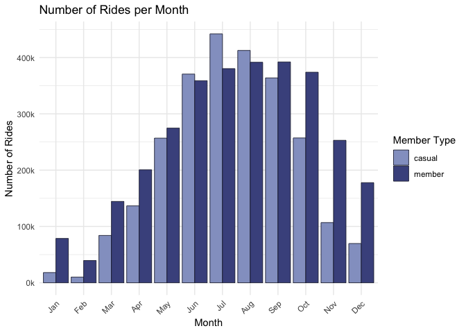

Cyclistic
================
Valeria Jimenez
2023-12-04

### Introduction

Cyclistic Bike Share is a bike-share program looking to maximize annual
memberships. **The goal is to find out how members differ from casual
(non-annual members) riders.**

------------------------------------------------------------------------

### Summary of Analysis

- Key Findings - Casual riders
  - Casual riders ride more on weekends
  - Weekends: rides peak in the afternoon with normal distribution
  - Casual riders have much longer ride lengths (roughly twice as long)
  - Most popular start and end station: Streeter Dr & Grand Ave
  - Casual riders ride more in the peak Summer period and ride less in
    the low Winter period than members
- Key Findings - Members
  - Members ride more on weekdays
  - Weekdays: rides peak at rush hour
  - Most popular start and end station: Clark St & Elm St
- Key Findings - General
  - Regardless of membership status, ridership peaks in the Summer (June
    to September) and hits an all time low during Winter (November to
    February)

------------------------------------------------------------------------

### Visualizations and Findings

#### Package Imports

``` r
library(tidyverse)
library(janitor)
library(lubridate)
```

#### Import CSVs and merge into a dataframe

Data from Google Data Analytics Course

``` r
jan2021 <- read_csv('divvy_monthlytripdata/202101-divvy-tripdata.csv')
feb2021 <- read_csv('divvy_monthlytripdata/202102-divvy-tripdata.csv')
mar2021 <- read_csv('divvy_monthlytripdata/202103-divvy-tripdata.csv')
apr2021 <- read_csv('divvy_monthlytripdata/202104-divvy-tripdata.csv')
may2021 <- read_csv('divvy_monthlytripdata/202105-divvy-tripdata.csv')
jun2021 <- read_csv('divvy_monthlytripdata/202106-divvy-tripdata.csv')
jul2021 <- read_csv('divvy_monthlytripdata/202107-divvy-tripdata.csv')
aug2021 <- read_csv('divvy_monthlytripdata/202108-divvy-tripdata.csv')
sep2021 <- read_csv('divvy_monthlytripdata/202109-divvy-tripdata.csv')
oct2021 <- read_csv('divvy_monthlytripdata/202110-divvy-tripdata.csv')
nov2021 <- read_csv('divvy_monthlytripdata/202111-divvy-tripdata.csv')
dec2021 <- read_csv('divvy_monthlytripdata/202112-divvy-tripdata.csv')

entire_dataset <- list(jan2021, feb2021, mar2021, apr2021, may2021, jun2021, jul2021, aug2021, sep2021, oct2021, nov2021, dec2021)

for (dataset in entire_dataset) {
  str(dataset)
}

merged_df <- bind_rows(entire_dataset)
merged_df <- clean_names(merged_df)
merged_df <- remove_empty(merged_df, which = c())
```

#### Add features to aid analysis

``` r
merged_df$day_of_week <- wday(merged_df$started_at, label = T, abbr = T)
merged_df$starting_hour <- format(as.POSIXct(merged_df$started_at), '%H')
merged_df$month <- format(as.Date(merged_df$started_at), '%m')
merged_df$ride_length <- difftime(merged_df$ended_at, merged_df$started_at, units = 'sec')
clean_df <- merged_df[!(merged_df$ride_length <= 0),]
```

#### Export CSV

``` r
write.csv(clean_df, file = 'cyclistic_df.csv')
```

------------------------------------------------------------------------

### How do casual riders differ from members?

- Number of Rides per Week

<!-- -->

- Number of Rides per Month

<!-- -->

- Hourly Rides per Weekday

<!-- -->

- Average Trip Duration for Casual Riders and Members

<!-- -->

- Top Start and End Stations

<!-- -->

- Top Start and End Stations (Members)

<!-- -->

- Top Start and End Stations (casual riders)

<!-- -->

- Number of rides by month

<!-- -->

------------------------------------------------------------------------

### Hypotheses

- Members are mostly commuters using the bike share in order to get to
  and from work
- Casual riders (many might be tourists) use the bike share for
  recreational long weekend rides
- Ridership falls in the winter due to cold temperatures (hypothesis
  could be strengthened with weather data)

------------------------------------------------------------------------

### Recommendations

1.  Target casual **weekend** riders and encourage them to become
    members by **introducing weekend memberships**.
2.  Target casual **weekday** riders and encourage commuting via bike
    share by **introducing special rush hour memberships**.
3.  **Reward casual riders with long bike rides** and encourage them to
    switch to a membership.
4.  Continue to promote annual memberships at the stations most popular
    with current annual members in order to **target potential
    commuters/members**.
5.  Investigate why Streeter Dr & Grand Ave is so popular with casual
    riders.
6.  **Adjust membership plans (ie. seasonal plans)** in order to account
    for Summer spikes and Winter dips. Spend more on marketing in the
    Summer months.
7.  Create general incentives to encourage members to remain members and
    casual riders to convert - for example, **a small non-member
    surcharge on all casual rides**.
